SMB Starter Kits

AD Connector Deployment Guide

This starter kit adds an Active Directory Connector to a
customer-managed Active Directory that was deployed using the
Windows-Migration-Starter-Kit in a single-directory use case.

This kit will not deploy without the Windows-Migration-Starter-Kit
stack. This kit is not suitable for a customer who plans on deploying
multiple directories. If you plan on deploying multiple Active
Directories with multiple connectors, a better solution is to add the AD
Connectors manually.

AD Connector is made available to you free of charge to use with
WorkSpaces and certain other AWS services. If there are no WorkSpaces
being used with your AD Connector directory for 30 consecutive days,
this directory will be automatically deregistered for use with Amazon
WorkSpaces, and you will be charged for this directory as per the [AWS
Directory Service pricing
terms](https://aws.amazon.com/directoryservice/pricing/).

This Kit deploys:

1)  AWS AD Connector, which connects the Managed Active Directory to
    certain AWS Services, such as Amazon WorkSpaces.

2)  An Active Directory Group with sufficient privileges to connect the
    AD Connectory to the Active Directory.

3)  AWS Secrets Manager secret, which stores the AD Connector user name
    and password.

**Step 1 -- Preparing the Windows Domain for AD Connector**

In Domain Controller 1, open the C:\\Helper-Scripts folder. Right-click
the "Utility-Prepare-AD-Connector" script, and left-click Run With
Powershell.

This script creates an Active Directory group in the Users container
called AwsConnectors that is delegated the permissions to add or delete
Users, Groups, and Computers.

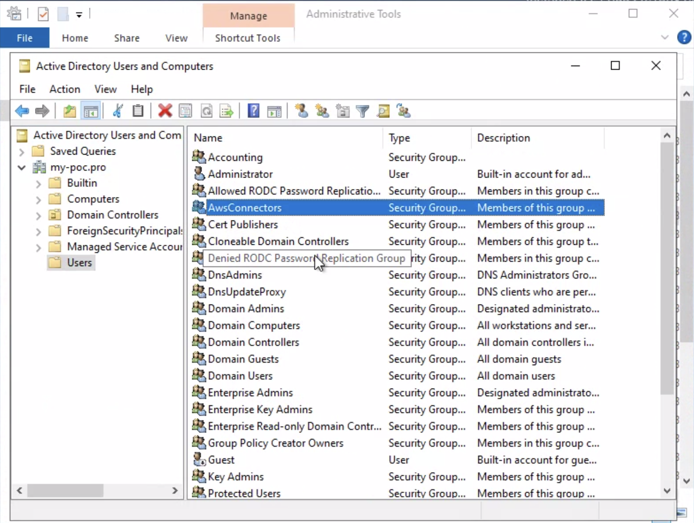

A new user must be created, and placed in this group. Right click the
Users folder, left click New, and then User.

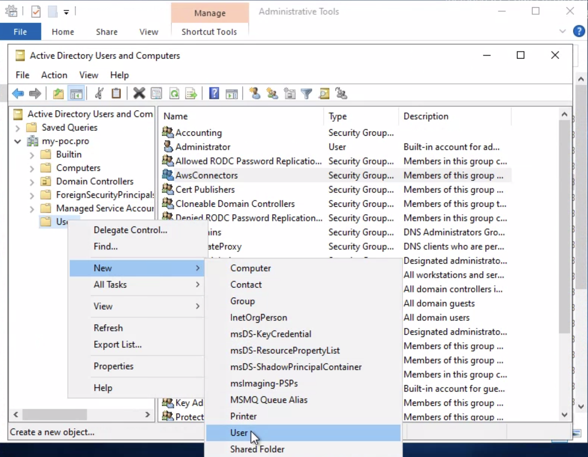

Give the user a recognizable Name and User logon name. Click Next.

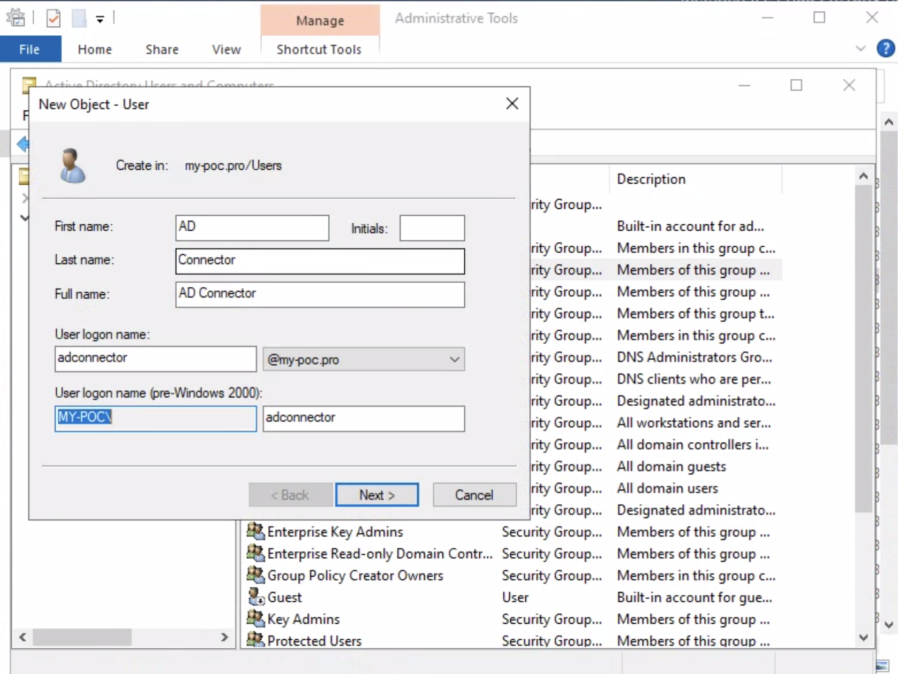

Provide a strong password for the user. Very Important -- "User Cannot
Change Password" and "Password Never Expires" should be selected. If you
are required to rotate these passwords, you can change the AD Connector
password manually as instructed in [this
document.](https://docs.aws.amazon.com/directoryservice/latest/admin-guide/ad_connector_update_creds.html)
If you do have to rotate the password, also remember to change the
password in Secrets Manager.

After the user is created, right click the user, and left-click Add to a
group.

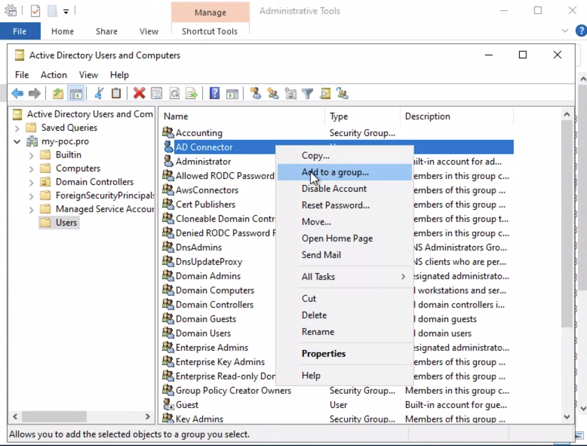

Enter the letters AWS and click next -- this will either put the user in
the AwsConnectors group, or show a list of groups that begin with AWS.
If a list is shown, select the AwsConnectors group.

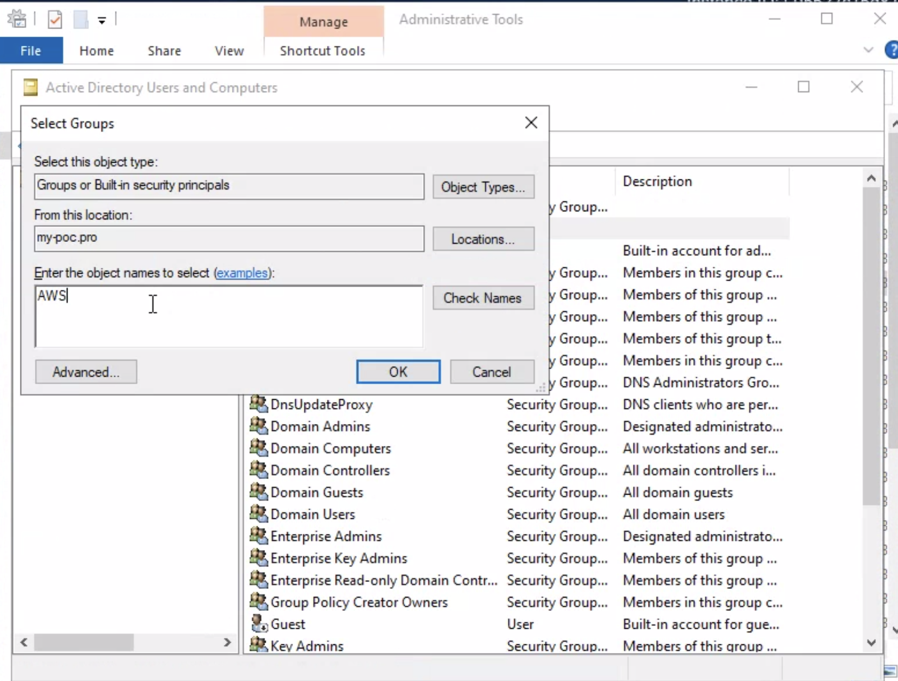

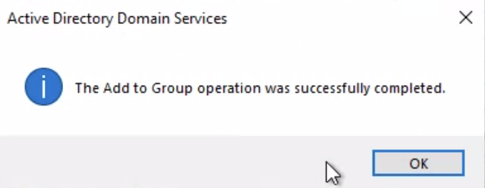

If you wish to verify group membership, right click on the AwsConnectors
group, and left click Properties.

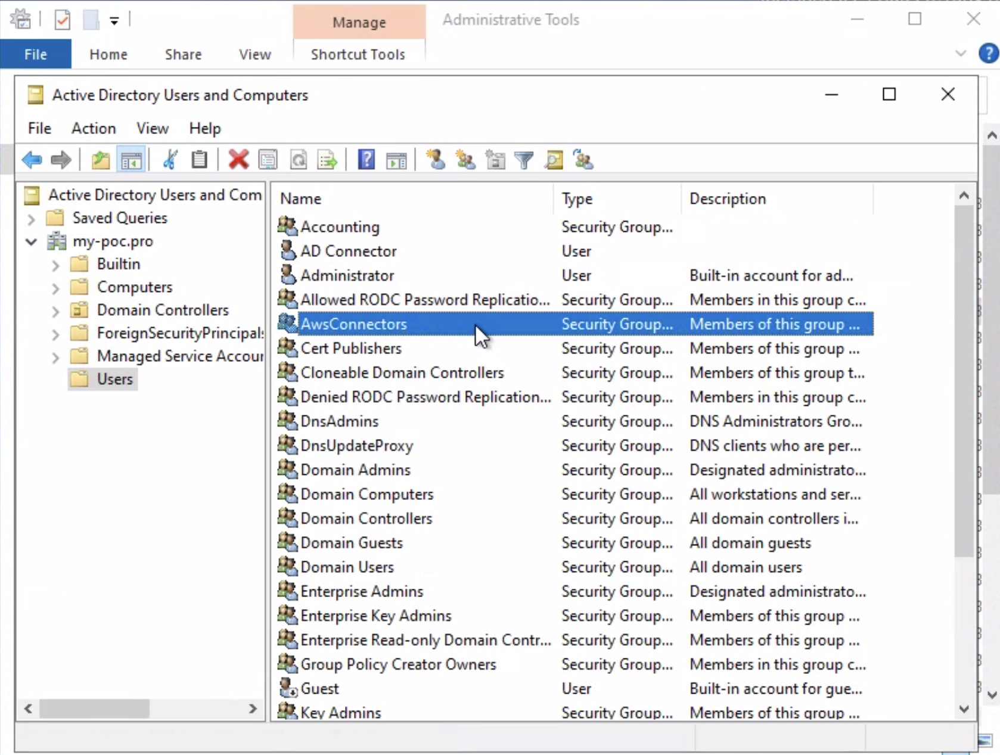

Click the Members tab.

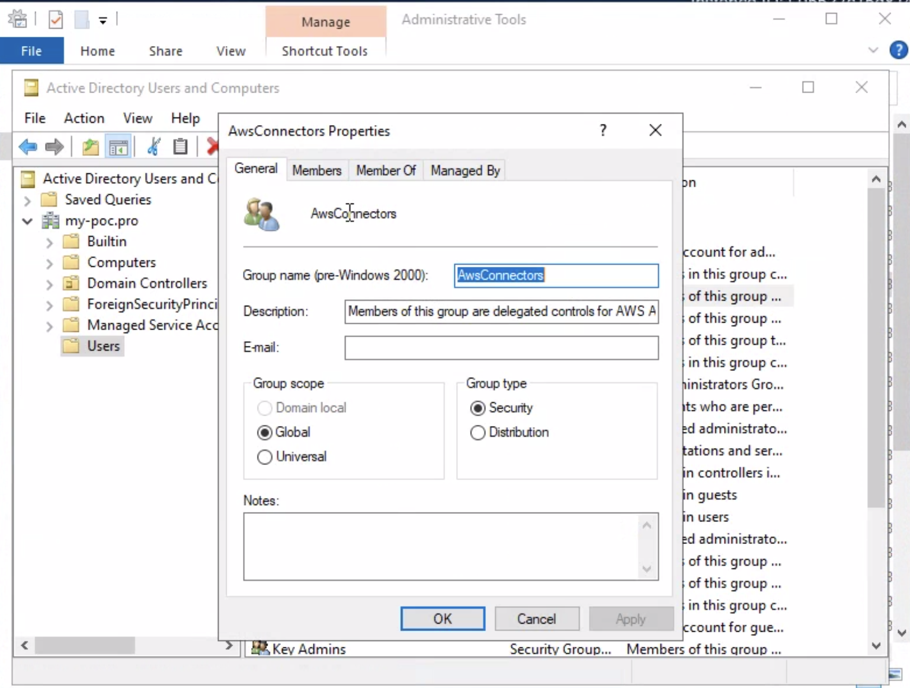

The AD Connector account that you created should be in the Members list.

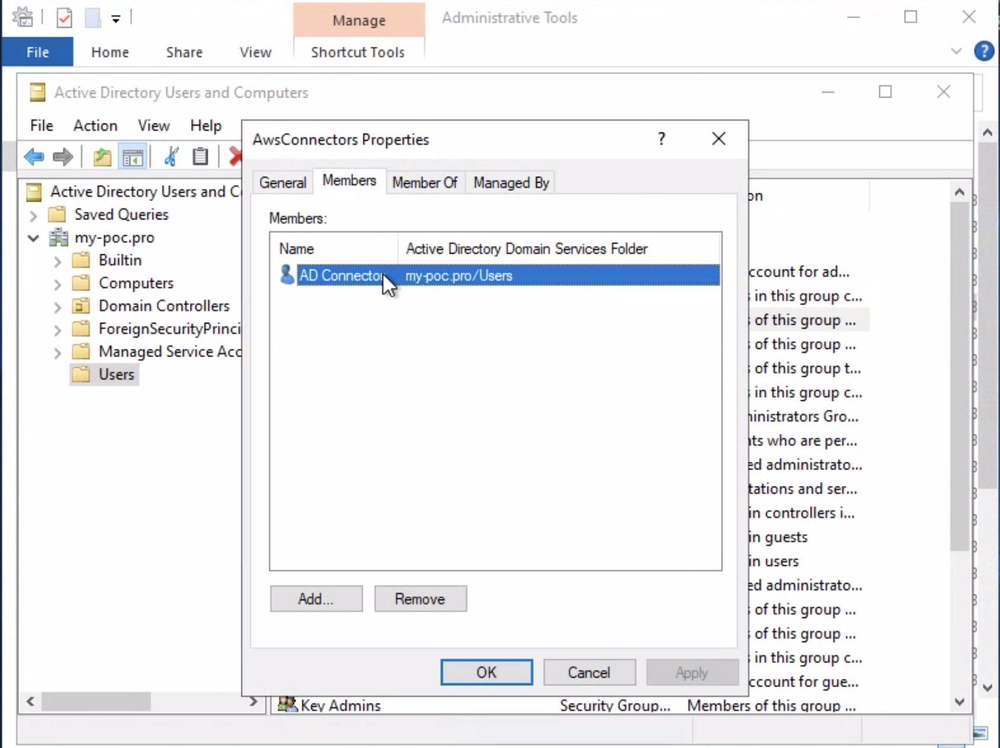

Step 2 -- Create the AD Connector Stack in CloudFormation.

Navigate to the CloudFormation in the AWS Console. Click the Create
Stack button, and select With new resources.

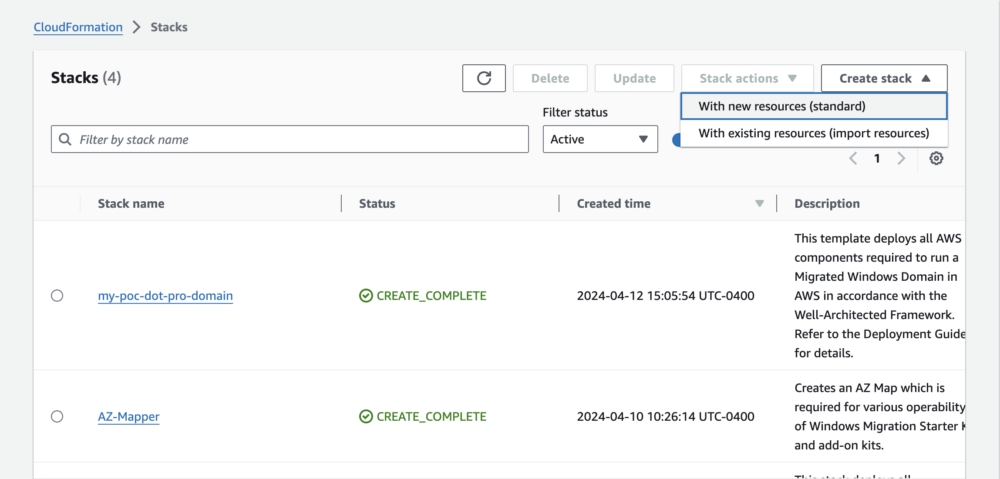

You can either directly upload the template, or upload the template to
an S3 bucket, providing the S3 URL.

Provide a stack name, and the user name and password of the AD Connector
account that was created in Active Directory in step 1. Click Next.

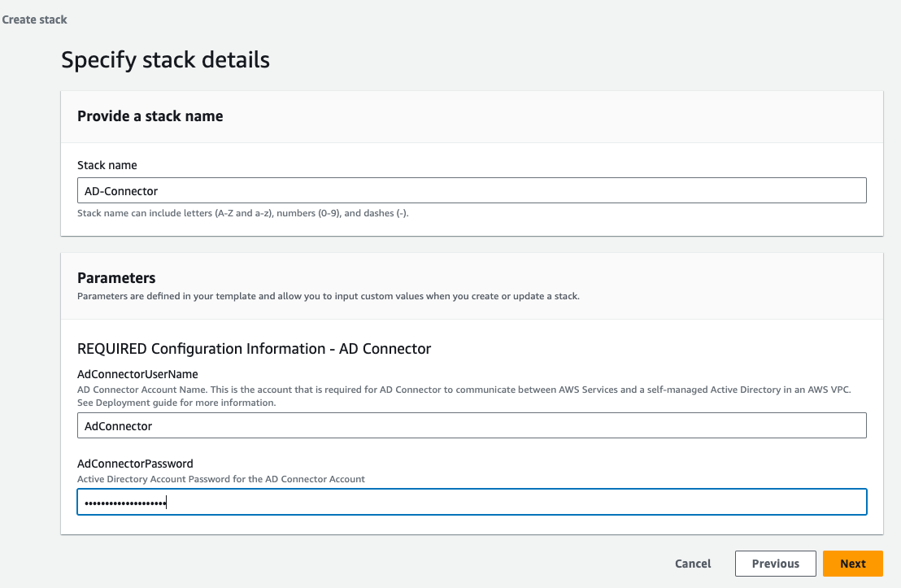
Click Next.

Check the "I Acknowledge that AWS CloudFormation might create resources
with custom names" box, then click Submit.

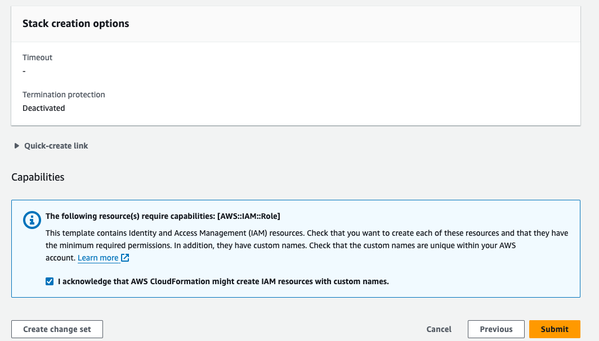

A Directory Connector can take as long as 30 -- 45 minutes to complete.
In the AWS Console, navigate to Directory Service. In the left menu,
expand Active Directory, the select Directories. You will either see a
status of "Creating", or "Active" when the directory is ready.

Once the Status is Active, the Directory Connector is ready to be used
and other AWS services can be connected to your directory.

If the Directory is not ready, or comes up "Failed", the issue is likely
to be a bad password. You can delete and re-create the stack if this
happens.
